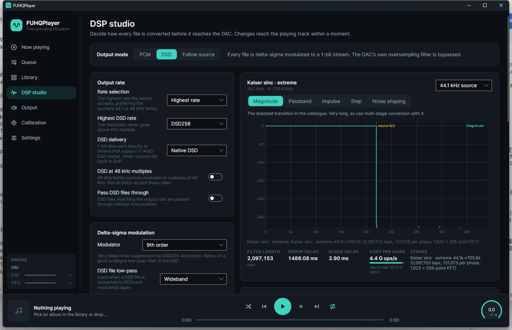
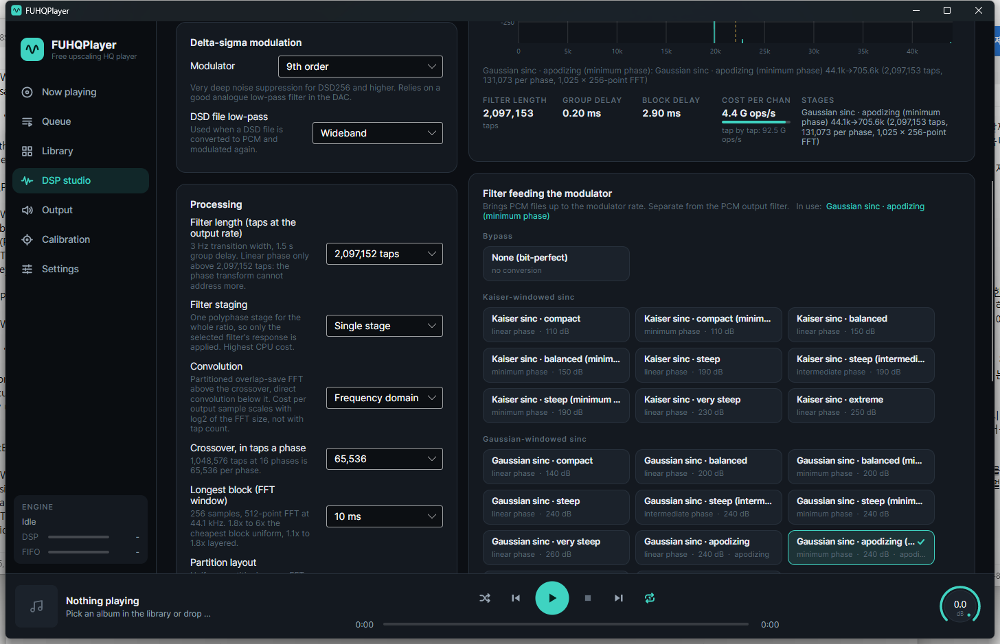
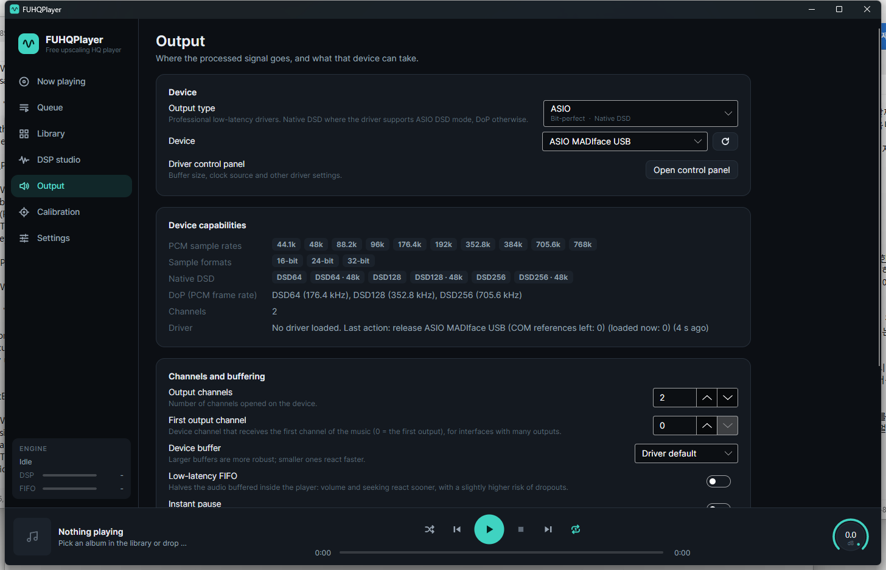
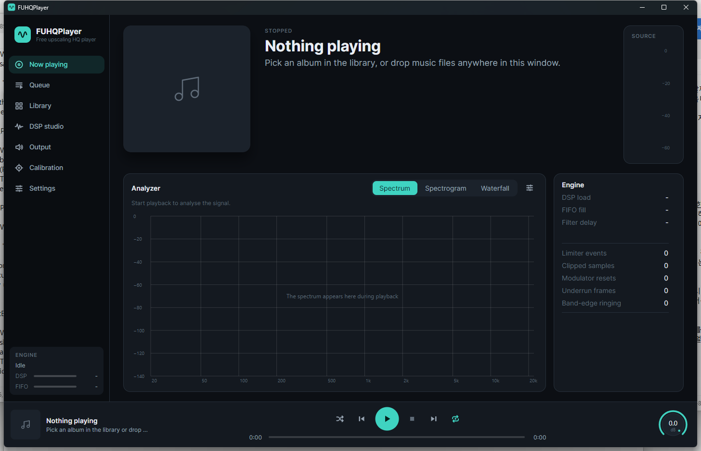
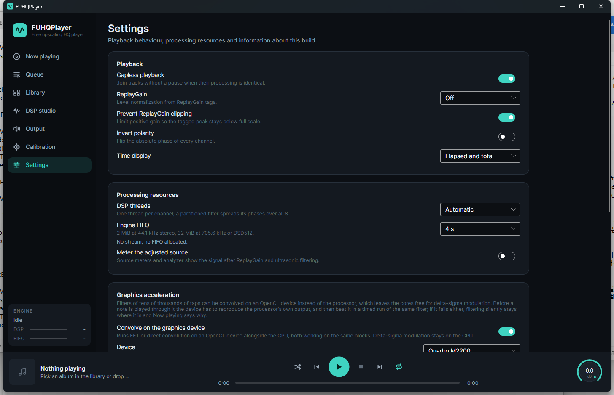

<div align="center">


# FUPlayer

**Free Upscaling Player**

An audio player that resamples with very long FIR filters and can modulate everything to DSD,
so your DAC's own oversampling filter and modulator never run.

[](LICENSE)
[](https://dotnet.microsoft.com/)
[](https://avaloniaui.net/)
[](#requirements)
[](#status)



</div>

---

## Contents

<details open>
<summary>Table of contents</summary>

- [What it does](#what-it-does)
- [Status](#status)
- [Features](#features)
- [Screenshots](#screenshots)
- [Getting started](#getting-started)
  - [Requirements](#requirements)
  - [Download](#download)
  - [Build from source](#build-from-source)
  - [First run](#first-run)
- [How it works](#how-it-works)
  - [The signal path](#the-signal-path)
  - [Filters](#filters)
  - [Two ways to convolve](#two-ways-to-convolve)
  - [Partition layout](#partition-layout)
  - [Graphics acceleration](#graphics-acceleration)
  - [DSD output](#dsd-output)
- [Performance](#performance)
- [Command line](#command-line)
- [Repository layout](#repository-layout)
- [Documentation](#documentation)
- [Contributing](#contributing)
- [License](#license)
- [Acknowledgements](#acknowledgements)

</details>

---

## What it does

Every DAC contains a digital filter. It has to: a 44.1 kHz stream has images above 22.05 kHz that must be
removed before conversion to analogue. That filter runs on a small fixed-function block inside the chip, with a
budget of a few hundred taps and no choice of response.

FUPlayer does the same job on the host, where the budget is a few million taps and every property of the
filter is yours to choose. It reads your files, resamples them to the highest rate the DAC accepts, and sends
the result bit-perfect over WASAPI exclusive mode or ASIO. Because the signal arrives at the DAC already at its
maximum rate, the DAC's own filter has nothing left to do.

In DSD mode it goes further and delta-sigma modulates the signal to a 1-bit stream at up to 45 MHz, which
bypasses the DAC's modulator as well.

## Status

Version 0.1, early but working. The playback engine, the DSP chain, the decoders, both Windows audio back-ends
and the desktop interface are all functional, and PCM-to-DSD playback has been confirmed on real hardware over
ASIO. Expect rough edges, and expect settings to move between versions.

## Features

**Resampling**

- Integer-ratio polyphase resampling to any rate the device supports, up to 1.536 MHz PCM.
- Filter lengths from a few hundred taps up to **33,554,432 taps**, counted at the output rate.
- 29 filters: Kaiser and Gaussian windowed sinc in several steepnesses, apodizing, early roll-off, half-band,
  short low-ringing FIR, linear and cubic interpolation, and elliptic IIR.
- Linear, minimum and intermediate phase variants where the design allows them.
- Single-stage conversion, or a cascade with half-band stages for a fraction of the cost.
- Direct convolution or partitioned overlap-save FFT, with the crossover, the FFT window and the partition
  layout all exposed as settings.

**Output**

- WASAPI exclusive, WASAPI shared, ASIO, and a file back-end for offline rendering.
- Native DSD over ASIO, or DoP for any bit-perfect PCM link.
- DSD64 through DSD1024, in both the 44.1 kHz and 48 kHz families.
- 16 to 32 bit PCM with eleven dither and noise-shaping options.
- Six delta-sigma modulators from 5th to 9th order, and five low-pass filters for DSD to PCM conversion.

**Analysis**

- Filter magnitude, passband, impulse, step and noise-shaping plots, computed from the filter that will actually
  run, before you commit to it.
- Group delay, added block delay, tap count and arithmetic cost per channel shown for the current settings.
- Live spectrum, spectrogram and waterfall of the source or the processed signal, with peak hold.
- Per-channel level meters, limiter and clipping counters, and a band-edge ringing detector.

**Performance**

- Multi-threaded: channels in parallel, and each channel's polyphase phases spread over the remaining cores.
- Optional OpenCL offload of the convolution to a GPU, in 64-bit or 32-bit arithmetic, with the split between
  CPU and GPU measured during playback rather than assumed.
- A device must reproduce the processor's own output before it is used for anything.

**Library and playback**

- Folder-based library with tag reading, cover art, album and artist views, and a search syntax
  (`+artist:bach album:cello`).
- Watches its folders and rescans quietly in the background.
- Gapless playback, ReplayGain, queue with drag reordering, speaker distance and level calibration.
- FLAC, WAV, AIFF, DSF and DFF decoded natively. Anything else through optional FFmpeg libraries.

## Screenshots

<table>
  <tr>
    <td width="50%"><br><em>Filter catalogue and processing settings</em></td>
    <td width="50%"><br><em>Device capabilities, probed from the driver</em></td>
  </tr>
  <tr>
    <td width="50%"><br><em>Now playing, with the analyzer and engine counters</em></td>
    <td width="50%"><br><em>Processing resources and graphics acceleration</em></td>
  </tr>
</table>

## Getting started

### Requirements

| | |
| --- | --- |
| **OS** | Windows 10 or 11, x64 |
| **Runtime** | None for the release zip, which bundles .NET 9. Building from source needs the [.NET 9 SDK](https://dotnet.microsoft.com/download/dotnet/9.0) |
| **CPU** | Any x64 with AVX2 for comfortable use. A 4-core laptop plays 1M taps to 705.6 kHz in real time |
| **DAC** | Anything with a WASAPI or ASIO driver. ASIO is required for native DSD |
| **Optional** | An OpenCL 1.2 device for GPU offload; FFmpeg LGPL builds for formats beyond FLAC, WAV, AIFF, DSF and DFF |

### Download

Grab the latest `FUPlayer-x.y.z-win-x64.zip` from the
[releases page](https://github.com/jerrybeomsoo/FUPlayer/releases), unpack it anywhere and run
`FUPlayer.exe`. The archive carries its own copy of .NET, so nothing has to be installed first, and
`fuplayer-cli.exe` sits next to it.

### Build from source

```bash
git clone https://github.com/jerrybeomsoo/FUPlayer.git
cd FUPlayer
dotnet build -c Release
```

Run the player:

```bash
dotnet run -c Release --project src/FUPlayer.App
```

Or the command line tool:

```bash
dotnet run -c Release --project src/FUPlayer.Cli -- devices
```

The solution also opens in Visual Studio 2022 (17.14 or newer) and JetBrains Rider. See
[docs/building.md](docs/building.md) for a self-contained publish, for the FFmpeg option, and for the
`FuPlayerDebugDsp` switch that turns off optimisation in the DSP library while debugging.

### First run

1. **Output** page: choose the back-end and device. WASAPI exclusive is the safe default; ASIO gives you native
   DSD if the driver supports it. The page shows the sample rates, formats and DSD modes the driver reports.
2. **DSP studio**: choose PCM or DSD output, then a filter and a filter length. Watch the group delay and the
   cost per channel as you change them.
3. **Library**: add a music folder, or drag files onto the window.

Settings live in `%APPDATA%\FUPlayer`. Deleting that folder resets everything.

## How it works

### The signal path

```
file
 |
 +- decode (FLAC / WAV / AIFF / DSF / DFF native, others via FFmpeg)
 |
 +- DSD to PCM, if the source is DSD and the output is not
 |
 +- ReplayGain, ultrasonic low-pass
 |
 +- RESAMPLE          polyphase, one stage or a half-band cascade
 |    |
 |    +- direct convolution, or partitioned overlap-save FFT
 |    +- optionally split across CPU and GPU, phase by phase
 |
 +- volume, speaker trim, look-ahead limiter
 |
 +- PCM: dither and quantize        DSD: delta-sigma modulate
 |
 +- FIFO -> WASAPI exclusive / ASIO / DoP / file
```

Each channel runs the whole chain on its own thread. Within a channel, a long filter's polyphase phases are
spread over whatever cores the other channels leave free.

### Filters

A resampling filter here is a windowed sinc, designed at build time from a passband edge, a stopband edge and a
stopband attenuation. Lengthening it narrows the transition band rather than adding zeros: 262,144 taps at
705.6 kHz is a transition about 23 Hz wide, and 33,554,432 taps is under 0.2 Hz.

The cost of that is delay. A linear-phase FIR of N taps has a group delay of exactly (N-1)/2 output samples,
which is 186 ms at 262,144 taps and 24 seconds at 33.5 million. The DSP studio shows the figure before you
select the length. Minimum-phase variants remove almost all of it, at the price of a non-flat phase response.

### Two ways to convolve

Direct convolution costs one multiply-add per tap per output sample. At 16,384 taps a phase that is 16,384
multiply-adds for every sample that leaves the player, which is why it stops being practical somewhere in the
tens of thousands of taps.

Partitioned overlap-save convolution transforms a block of input once, multiplies it against pre-transformed
filter partitions, and transforms back. Its cost per output sample grows with log2 of the FFT size instead of
with the tap count, so a filter of a million taps costs roughly what a filter of a hundred thousand does. The
price is latency: the stage holds one block of input before it can answer.

Both compute the same convolution of the same coefficients. Rendered with flat dither, the two paths agree to
the last bit on short filters, and on long filters the frequency domain is measurably the more accurate of the
two, because it accumulates fewer rounding errors per output sample.

### Partition layout

A short FFT window gives back the latency but costs arithmetic, because the partition count rises as the window
shrinks: at 262,144 taps, going from a 46 ms block to a 1.5 ms block costs 13 times the multiply-accumulates.

Non-uniform partitioning fixes most of that. A band of taps starting at offset O only ever contributes to output
O samples behind the newest input, so it can be convolved in blocks of up to O samples and still never be late.
The early taps go in short windows and later ones in windows that double and double again, which brings the same
1.5 ms latency down from 13 times the cost to about 2 times. A small dynamic program picks the band layout
against a cost model, and returns a single band, which is ordinary uniform partitioning, wherever the extra
transforms would not pay.

Uniform partitioning is the default because it is the only layout a GPU kernel accepts.

### Graphics acceleration

The convolution of a long filter is thousands of independent multiply-accumulates, which suits a GPU. FUPlayer
will offload it to any OpenCL 1.2 device, in 64-bit or 32-bit arithmetic, but only after the device has
reproduced the processor's own output for that exact filter.

The work is divided by polyphase phase, not by channel. A stereo conversion at 16 phases has 32 independent
pieces of work per block, and the device can be given any number of them while the CPU convolves the rest of the
same block concurrently. How many is measured, not assumed: every split from none to all is timed during
playback, the fastest is used, and the winner is then checked against the device being left out entirely. If no
split makes the whole pipeline faster, the device is released and costs nothing.

Phases are handed over one channel at a time rather than spread evenly, so that a channel wholly on the device
carries on into the modulator while the device works. That ordering alone is worth 20 percent.

The processor transforms every input block for its own phases whether the device gets any or not, so the device
is handed the spectrum rather than transforming the block again. That takes the per-block cost of having a
device attached from 30 percent of the pipeline down to 11.

### DSD output

In DSD mode the signal is resampled to the modulator rate and then delta-sigma modulated to 1 bit. Six
modulators are available, from a 5th-order design with wide stability margins to a 9th-order one with very deep
in-band noise suppression for DSD256 and above.

DSD sources can be passed through unchanged when the output rate matches, converted to PCM with a choice of
low-pass filters, or remodulated.

## Performance

Measured on an i7-7820HQ laptop, 4 cores and 8 threads with AVX2, and a Quadro M2200. 90 seconds of 44.1 kHz
stereo converted to 705.6 kHz with a Gaussian windowed sinc, single stage, best of two runs:

| Filter length | Convolution | Processor | With the GPU (64-bit) | With the GPU (32-bit) |
| --- | --- | --- | --- | --- |
| 262,144 taps | Partitioned FFT | **13.9x** real time | 13.0x, device released | 12.8x, device released |
| 1,048,576 taps | Partitioned FFT | **10.1x** real time | 9.6x, device released | 9.6x, device released |
| 65,536 taps | Direct | 5.6x real time | 5.7x | **7.2x** |
| 2,097,152 taps, 10 ms blocks | Partitioned FFT | 1.5x real time | 1.9x | **2.4x** |

DSD output on the same machine: DSD256 at 5.0x real time, DSD512 at 2.6x, DSD1024 at 1.5x.

The GPU is worth having where the filter dominates the pipeline and the arithmetic is 32-bit. Where the CPU is
already faster, the measurement says so and the device is released, which is why two rows above are slower with
it than without: the difference is the few seconds of measurement at the start of the stream.

## Command line

`fuplayer-cli` is a headless companion for device listing, offline rendering and benchmarking.

```bash
# What can this machine play through, and at what rates
fuplayer-cli devices

# Render an album to 705.6 kHz WAV with a million-tap filter
fuplayer-cli render *.flac --out ./rendered --rate 705600 --taps 1048576 --staging single

# How many times faster than real time does this conversion run
fuplayer-cli bench track.flac --mode dsd --dsd 256 --gpu
```

Every processing setting in the interface has a command line equivalent. See [docs/cli.md](docs/cli.md).

## Repository layout

```
src/
  FUPlayer.Core/            engine, DSP, decoders, settings. No UI, no platform code
    Dsp/Resampling/           polyphase stages, partitioned FFT, filter catalogue
    Dsp/Acceleration/         OpenCL offload and the CPU/GPU split
    Dsp/Modulation/           delta-sigma modulators
    Dsp/Quantization/         dither and noise shaping
    Engine/                   playback engine, DSP pipeline, output planner, FIFO
  FUPlayer.Audio.Windows/   WASAPI and ASIO back-ends
  FUPlayer.App/             Avalonia interface
  FUPlayer.Cli/             headless tool
docs/                         documentation and screenshots
build/ffmpeg/                 script that builds LGPL FFmpeg libraries
```

## Documentation

| Document | What is in it |
| --- | --- |
| [docs/building.md](docs/building.md) | Building, publishing, and the optional FFmpeg libraries |
| [docs/architecture.md](docs/architecture.md) | Projects, threading model, and the classes that matter |
| [docs/dsp.md](docs/dsp.md) | The signal processing in detail, with the arithmetic |
| [docs/cli.md](docs/cli.md) | Every `fuplayer-cli` command and option |
| [docs/settings.md](docs/settings.md) | Every setting, what it changes, and what it costs |
| [docs/building-ffmpeg.md](docs/building-ffmpeg.md) | Building the LGPL FFmpeg DLLs from source |

## Contributing

Issues and pull requests are welcome. Please read [CONTRIBUTING.md](CONTRIBUTING.md) first; it covers the code
style, the licence constraint on dependencies, and how to check that a DSP change did not alter the output.

## License

FUPlayer's own code is [MIT](LICENSE).

It uses Avalonia (MIT), CommunityToolkit.Mvvm (MIT) and TagLib# (LGPL-2.1), and optionally loads FFmpeg
libraries built under the LGPL. The LGPL components stay separate, replaceable libraries. See
[THIRD-PARTY-NOTICES.md](THIRD-PARTY-NOTICES.md).

## Acknowledgements

Every filter, modulator and noise shaper here is designed from openly published theory, credited where it is
used in [THIRD-PARTY-NOTICES.md](THIRD-PARTY-NOTICES.md): Kaiser's window, Orfanidis on elliptic filter
design, Lipshitz, Vanderkooy and Wannamaker on psychoacoustic noise shaping, and Schreier and Temes on
delta-sigma conversion.

Built with [Avalonia](https://avaloniaui.net/), [CommunityToolkit.Mvvm](https://github.com/CommunityToolkit/dotnet)
and [TagLib#](https://github.com/mono/taglib-sharp).
